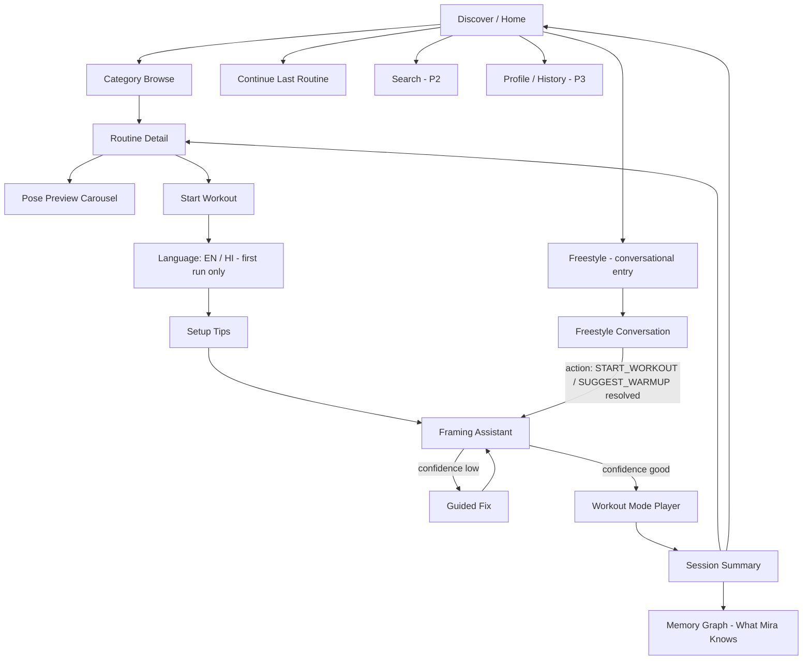

# Mira.ai — Feature & Build Specification
### On-Device AI Movement Coach for iQOO 15 (Android)

**Version:** 2.1 — Spec-Driven Development Build Spec (adds Freestyle conversational mode + Memory Graph, corrects TTS choice)
**Audience:** Human engineers + AI coding assistants (Claude Code) implementing directly from this document.
**Scope:** MVP ships 3 poses inside a real routine/category structure, PLUS a Freestyle conversational entry mode that demonstrates proactive memory, engineered as the first module of a reusable on-device coaching platform.

> How to use this doc if you are an AI coding assistant: Section 5 (Screens) and Section 8 (Workout Mode) contain user stories with `Given/When/Then` acceptance criteria — implement against those directly. Section 4 defines the exact data model. Section 9.3 defines package structure. Do not invent screens, states, or fields not listed here; if something is ambiguous, prefer the narrowest interpretation consistent with Section 2's design principles.

---

## 1. Product Summary

Mira.ai turns the iQOO 15's camera into a personal movement coach. It watches the user practice yoga, measures posture deterministically (no LLM guessing at biomechanics), and speaks progressive, human-feeling corrections through a stateful coaching agent — entirely on-device.

> **Demo:** the user opens Freestyle, has a short spoken exchange where Mira proactively suggests a warm-up based on memory of their routine, then transitions straight into live-corrected yoga coaching, and closes by revealing what it has learned about them as a memory graph.
> **Product:** a personal coaching agent for iQOO that can extend to fitness, gait, mobility, and recovery.

Two brains, one mouth:
- **Assessor** (deterministic CV + rules) — measures truth, counts reps, times holds.
- **Coach Agent** (stateful reasoning) — decides what to say and when, sequences the routine, AND drives the Freestyle conversation via a bounded intent set (Section 10.5).
- **Mouth** (voice + on-screen overlay) — delivers it.

The app has **two entry paths into the same coaching core**:
1. **Browse path** (Section 3, 5, 8) — Discover → Category → Routine Detail → Workout Mode Player — a real workout-app experience.
2. **Freestyle path** (Section 5, US-8) — a conversational voice-first entry that leads into the exact same Workout Mode Player, but arrived at via dialogue instead of browsing, and demonstrating proactive User Memory.

Both paths converge on the same Session Summary, which now offers a path into the **Memory Graph** screen (US-9) — the visual proof of what the agent has learned.

The MVP demonstrates **3 poses**, but they are not presented as 3 isolated demos — they are presented the way real wellness apps present content: as **categorized, bundled routines** the user browses, previews, and works through in a guided **Workout Mode** with pause, rep count, and hold timers. The 3 poses are simply the first fully-implemented content in an architecture built to hold many.

---

## 2. Design Principles (what "much better UX" means here)

Mira.ai should feel like a category-defining wellness app (Down Dog, Nike Training Club, Alo Moves, Apple Fitness+) that happens to have a live AI coach inside the workout player — not a camera-utility demo with a pose picker bolted on.

1. **Browse before you commit** — for users who want to choose. Users discover movements the way they discover a Spotify playlist — by category and by routine, not by hunting for a specific pose name.
2. **Or just talk** — for the demo moment. Freestyle is not a lesser/hidden mode; it's a first-class entry point given equal visual weight on Home, because it's what makes the memory/agent story tangible instead of claimed.
3. **Bundling over isolation.** Poses are never presented as a flat list. They're grouped into **Routines** which are grouped into **Categories**.
4. **Workout Mode is a real workout player.** Pause/resume, skip, rep counter, per-asana hold timer, progress ring, and an exit-confirmation — regardless of whether you arrived via Browse or Freestyle.
5. **Live coaching is layered on top of, not instead of, good workout UX.** The AI correction voice and skeleton overlay sit inside the same polished player used for counting and timing — they are one experience, not two screens stitched together.
6. **Content model scales; MVP content doesn't have to.** Only 3 poses / 1–2 routines need working Assessor rule sets for the hackathon; everything else should be structured so adding pose #4 is a content change, not a re-architecture.
7. **Memory should be felt, then shown.** Freestyle's proactive suggestion is memory *felt* in conversation; the Memory Graph screen is memory *shown* visually. Use both — neither replaces the other in the demo.
8. **Calm, premium, non-clinical visual tone.** No red error banners, no camera-app chrome. Soft color, rounded cards, generous white space — this is a wellness brand, not a debugging tool.

### 2.1 Reference pattern (for the coding agent / designer)
Standard modern fitness-app IA: **Discover (home) → Category → Routine detail (with pose list + preview) → Workout Mode (player) → Summary**, with a parallel **Freestyle** entry that skips straight to a conversational setup and lands in the same player. Mira-specific additions: the **live AI coaching layer** inside the Workout Mode player, a **Framing Assistant** step, the **Freestyle conversational screen**, and the **Memory Graph** screen reached from Summary.

---

## 3. Information Architecture



### 3.1 Categories (content taxonomy)

| Category | Body focus | MVP coverage |
|---|---|---|
| Full Body | Standing strength + balance | **MVP routine lives here** |
| Legs & Balance | Hips, knees, ankles, stability | Tree Pose, Warrior II |
| Neck & Shoulders | Upper-body mobility | Roadmap (P3 content) |
| Core | Trunk stability | Roadmap |
| Recovery & Rest | Gentle, low-intensity | Roadmap |

### 3.2 MVP Routine

**Routine: "Foundations — Full Body Wake-Up"**
Category: Full Body · 3 poses · ~6–8 min · Beginner

| Order | Pose | Category tag | Hold target | Reps |
|---|---|---|---|---|
| 1 | Warrior II (both sides) | Legs & Balance, Full Body | 20s per side | 2 sides |
| 2 | Tree Pose (both sides) | Legs & Balance | 15s per side | 2 sides |
| 3 | Chair Pose | Full Body | 20s hold | 2 rounds |

This single routine is what gets fully built for the demo, and is the routine Freestyle resolves to when the user accepts a suggested warm-up/workout — one content object, two entry paths.

### 3.3 Freestyle content note
Freestyle does not have its own content model — it is a conversational router that resolves to a `Routine` (Section 4.2) via the `ActionSchema` in Section 10.5, then hands off into the exact same Setup → Framing → Player flow as the Browse path. This keeps Freestyle low-risk: it's a dialogue layer on top of infrastructure that already has to exist for Browse.

---

## 4. Content Data Model

This is the canonical schema. All screens in Section 5 read from these shapes. AI coding assistants should generate Kotlin data classes matching this exactly.

### 4.1 Category

```kotlin
data class Category(
    val id: String,           // "full_body"
    val title: String,        // "Full Body"
    val subtitle: String,     // "Standing strength & balance"
    val iconRes: Int,
    val routineIds: List<String>
)
```

### 4.2 Routine

```kotlin
data class Routine(
    val id: String,                 // "foundations_full_body"
    val title: String,              // "Foundations — Full Body Wake-Up"
    val categoryIds: List<String>,  // can appear in multiple categories
    val level: RoutineLevel,        // BEGINNER | INTERMEDIATE | ADVANCED
    val estimatedDurationSec: Int,
    val coverImageRes: Int,
    val poseSequence: List<RoutineStep>,
    val isCoachingSupported: Boolean // true only if every pose in the sequence has an Assessor rule set
)

data class RoutineStep(
    val poseId: String,
    val side: PoseSide,             // NONE | LEFT | RIGHT | BOTH (renders as 2 steps if BOTH)
    val targetHoldSec: Int?,        // null if rep-based instead of hold-based
    val targetReps: Int?,           // null if hold-based instead of rep-based
    val order: Int
)

enum class RoutineLevel { BEGINNER, INTERMEDIATE, ADVANCED }
enum class PoseSide { NONE, LEFT, RIGHT, BOTH }
```

### 4.3 Pose (content + Assessor binding)

```kotlin
data class Pose(
    val id: String,                 // "warrior_ii"
    val displayName: String,        // "Warrior II"
    val sanskritName: String?,      // "Virabhadrasana II"
    val thumbnailRes: Int,
    val instructionSteps: List<String>, // shown in Pose Preview
    val defaultHoldSec: Int,
    val trackingMode: TrackingMode, // HOLD | REP_COUNT
    val hasAssessorRuleSet: Boolean // gates whether live AI coaching is available for this pose
)

enum class TrackingMode { HOLD, REP_COUNT }
```

### 4.4 Live session state (runtime, not content)

```kotlin
data class WorkoutSessionState(
    val routine: Routine,
    val currentStepIndex: Int,
    val phase: SessionPhase,        // SETUP | FRAMING | CORRECTING | HOLDING | REP_COUNTING | REST | PAUSED | STEP_COMPLETE | SUMMARY
    val elapsedHoldSec: Int,
    val repCount: Int,
    val lastVerdictCode: String?,
    val lastCueTimestampMs: Long,
    val improvedSinceLastCue: Boolean,
    val confidenceScore: Float,
    val isPaused: Boolean
)
```

This `WorkoutSessionState` is the single source of truth the Coach Agent harness (Section 10-11) reads and writes, and the UI (Compose) observes via `StateFlow`.

### 4.5 Freestyle conversation state (new in v2.1)

```kotlin
enum class ActionSchema {
    START_WORKOUT, SUGGEST_WARMUP, PAUSE, RESUME,
    SWITCH_POSE, END_SESSION, ANSWER_SMALLTALK, SHOW_MEMORY
}

data class AgentPrompt(
    val userUtterance: String,
    val allowedActions: List<ActionSchema>,  // always the fixed set above — never expanded at runtime
    val context: SessionContext
)

data class SessionContext(
    val timeOfDay: String,          // e.g. "evening"
    val lastRoutineId: String?,
    val relevantFacts: List<Fact>   // pulled from User Memory, see 4.6
)

data class AgentResponse(
    val action: ActionSchema,
    val spokenLine: String,
    val resolvedRoutineId: String?  // set when action == START_WORKOUT/SUGGEST_WARMUP
)
```

If the LLM/classifier returns anything outside `allowedActions`, the harness falls back to `ANSWER_SMALLTALK` with a template line and logs the miss — it never free-generates an unbounded action.

### 4.6 Memory Graph data model (new in v2.1)

```kotlin
data class Fact(
    val id: String,
    val subject: String,      // "user", "user.left_knee", "user.warrior_ii"
    val predicate: String,    // "prefers", "struggles_with", "avg_hold_time"
    val objectValue: String,  // "shorter_holds", "knee_alignment", "18s"
    val confidence: Float,    // 0..1, increases with repeated evidence
    val lastUpdated: Long,
    val sourceSessionId: String
)
```

`Fact` rows are what both the Freestyle proactive suggestion (queried into `SessionContext.relevantFacts`) and the Memory Graph screen (rendered as nodes/edges) read from — one table, two surfaces.

---

## 5. Screens — Spec-Driven User Stories

Each story includes acceptance criteria in `Given/When/Then` form for direct implementation.

### US-1 — Discover / Home
**As a** user opening the app, **I want** to see routines organized by category, my last session, and a Freestyle option, **so that** I can quickly resume, browse, or just talk to my coach.

- Given the user has completed at least one session, When Home loads, Then a "Continue" card shows the last routine with a resume button.
- Given the user has never opened the app, When Home loads, Then it shows the Freestyle hero card first, then the category rail with "Full Body" first and the Foundations routine featured.
- Given the user taps a category, When the tap registers, Then navigate to Category Browse filtered to that category's `routineIds`.
- Given the user taps the Freestyle hero card, When the tap registers, Then navigate to US-8 Freestyle Conversation.

**UI:** Vertically scrolling screen — Freestyle hero card (always visible, top) → hero "Continue" card (if applicable) → horizontally scrollable category rail → "Recommended for you" routine cards below.

### US-2 — Category Browse
(unchanged from v2.0)

- Given a category with N routines, When the screen loads, Then render N routine cards showing `title`, `estimatedDurationSec` (formatted as "6 min"), `level` badge, and cover image.
- Given a routine where `isCoachingSupported == false`, When rendered, Then show a "Preview only" badge and disable the "Start Workout" CTA.

### US-3 — Routine Detail
(unchanged from v2.0)

- Given a routine, When the detail screen loads, Then show a horizontally swipeable Pose Preview carousel.
- Given the user taps "Start Workout", When `isCoachingSupported == true`, Then navigate to Language selection (first run) or directly to Setup Tips.
- Given `isCoachingSupported == false`, the CTA is disabled with a tooltip.

### US-4 — Setup Tips
(unchanged from v2.0) — shown once, skippable thereafter via local flag.

### US-5 — Framing Assistant
(unchanged from v2.0) — confidence-gated, auto-advances when green for 1 sustained second.

### US-6 — Workout Mode Player (core screen)
See Section 8 for full behavioral spec. (unchanged from v2.0)

### US-7 — Session Summary
**As a** user finishing a routine, **I want** to see what I did, what to focus on next, and a path to see what Mira has learned, **so that** I feel a sense of progress and trust.

- Given the routine completes or the user taps "End Workout," When Summary renders, Then show total time, per-pose result, and one "Next time, focus on..." line derived from the most frequent `verdictCode`.
- Given the summary is shown, When the user taps "Done", Then return to Home with the "Continue" card pointing at a "Repeat" of this routine.
- Given the summary is shown, When the user taps "See what I've learned about you", Then navigate to US-9 Memory Graph. (new in v2.1)

### US-8 — Freestyle Conversation (new in v2.1)
**As a** user, **I want** to just talk to my coach instead of browsing, **so that** starting feels effortless and personal.

- Given the user opens Freestyle, When the screen loads, Then Mira greets first, unprompted, using `SessionContext` (time of day + last routine + relevant Facts) — e.g. "Good evening — ready to unwind? Want a quick warm-up before we move into a full routine?"
- Given the user responds affirmatively, When the STT transcript is classified, Then the harness emits an `AgentResponse` with `action == SUGGEST_WARMUP` or `START_WORKOUT`, resolving to a `Routine` id, and navigates to Setup Tips → Framing → Player exactly as the Browse path would.
- Given the user's utterance does not map to any `ActionSchema` with sufficient confidence, When classified, Then `action == ANSWER_SMALLTALK` fires with a template line, and the harness stays on the Freestyle screen (does not crash or hang).
- Given the AI is speaking or listening, When rendered, Then show only the orb + live caption per docs/ux/freestyle.md — no buttons except a small mic-mute affordance.
- Latency guardrail: if STT→classification→response exceeds 3 seconds, When evaluated, Then show a subtle "thinking" state on the orb rather than a frozen UI — never let silence read as broken.

### US-9 — Memory Graph (new in v2.1)
**As a** user, **I want** to see what Mira has learned about me, **so that** the memory claim feels real and I trust the privacy story.

- Given the user navigates here from Summary, When the screen loads, Then query all `Fact` rows and render as a node graph per docs/ux/memory-graph.md — central "you" node, radiating Fact nodes, edge opacity/thickness mapped to `confidence`.
- Given the user taps a Fact node, When tapped, Then expand a short card showing the fact in natural language plus its `sourceSessionId` count/recency.
- Given there are fewer than 3 Facts recorded (e.g. first-ever session), When rendered, Then show a calm empty/early state ("I'm still getting to know you") rather than a sparse broken-looking graph.
- Always render the reassurance line "Everything here stays on your phone" near the top.

---

## 6. Feature Spec Table

| ID | Feature | Description | Priority |
|---|---|---|---|
| F1 | Category & routine browse | Home, Category Browse, Routine Detail | P0 |
| F2 | Pose preview carousel | Swipeable pose cards before starting | P0 |
| F3 | Front-camera live capture | CameraX, 15–20 FPS pipeline | P0 |
| F4 | Pose detection & landmarks | Body landmark extraction per frame | P0 |
| F5 | Framing assistant | Pre-coaching confidence gate | P0 |
| F6 | Deterministic posture assessment | Angles, alignment, symmetry, verdict codes | P0 |
| F7 | Progressive voice coaching | Gentle → reassess → specific → confirm | P0 |
| F8 | Workout Mode player | Pause/resume, progress indicator, exit confirm | P0 |
| F9 | Hold timer per asana | Countdown ring vs. `targetHoldSec`, form-gated completion | P0 |
| F10 | Rep counter per asana | Increments on Assessor-detected full-motion cycles | P0 |
| F11 | Skeleton + angle overlay | Transparent live trust layer | P0 |
| F12 | On-device only | No frame leaves device, no account required | P0 |
| F13 | Confidence gating | Recover-framing UX mid-workout | P0 |
| F14 | Session summary | Per-pose results + next-focus line | P0 |
| F15 | Multi-pose routine sequencing | Auto-advance between steps, rest between sides | P0 |
| F16 | Second/third pose content | Tree, Chair rule sets | P0 |
| F23 | **Freestyle conversation** | Voice-first entry, proactive memory-based suggestion, bounded ActionSchema | **P0** (new) |
| F24 | **Memory Graph screen** | Fact-graph visualization reached from Summary | **P0** (new) |
| F17 | Hindi TTS + UI copy | Localized coaching voice | P1 |
| F18 | Skip pose (within routine) | Manual advance without penalty | P1 |
| F19 | Additional routines/categories (content only) | New JSON content, no new code path | P2 |
| F20 | Voice commands ("Pause", "Skip", "Repeat") | Hands-free control outside Freestyle | P2 |
| F21 | Local session history / streak | Profile screen, on-device only | P3 |
| F22 | Search | Free-text routine/pose search | P3 |

F23 and F24 are elevated to P0 because they are the demo's differentiating moments — without them the build is a (very good) generic pose-correction app, which is exactly the crowded-category risk flagged in the project's own competitive analysis.

---

## 7. Design System (tokens for implementation)

(unchanged from v2.0)

| Token | Value | Usage |
|---|---|---|
| `color.primary` | Deep sage green `#2F5D50` | Primary CTAs, active states |
| `color.accent` | Warm terracotta `#E08E5B` | Progress rings, highlights, rep counter |
| `color.background` | Off-white `#FAF8F4` | Screen backgrounds (light mode default) |
| `color.surface` | White `#FFFFFF` with 12dp rounded corners | Cards |
| `color.success` | Muted green `#4C9A6E` | Step-complete states |
| `color.caution` | Warm amber `#D9A441` | Low-confidence, not error-red |
| `type.display` | 28sp, semi-bold | Routine titles |
| `type.title` | 20sp, medium | Section headers, pose names |
| `type.body` | 16sp, regular | Instructions, cues captions |
| `type.caption` | 13sp, regular | Metadata (duration, level) |
| `spacing.unit` | 8dp base grid | All padding/margins as multiples of 8 |
| `radius.card` | 16dp | Cards, buttons |
| `motion.stepTransition` | 300ms ease-in-out | Between workout steps |

Cross-check against docs/ux/*.md Stitch exports before implementation — if a token conflicts with what Stitch generated, the Stitch export is the newer source and should win; flag the conflict rather than silently picking one.

---

## 8. Workout Mode — Detailed Behavior Spec

(unchanged from v2.0 — Sections 8.1 through 8.7 apply identically regardless of whether the player was entered via Browse or Freestyle)

### 8.1 Player layout (top → bottom)
1. **Top bar:** step progress ("Step 2 of 5"), pause button (top-right), routine title (small, top-left).
2. **Camera stage:** full-bleed front camera preview with skeleton overlay drawn on top; confidence dot top-right of the stage.
3. **Metric ring/counter:** HOLD poses → circular countdown ring; REP_COUNT poses → rep number with "+1" pulse.
4. **Cue caption bar:** captions the current spoken cue.
5. **Bottom controls:** Pause/Resume (primary), Skip (secondary, P1).

### 8.2 Pause behavior
Pausing stops hold countdown, rep counting, new voice cues. Camera preview and skeleton stay live. Resuming restores exact prior state.

### 8.3 Hold-timer logic
Timer advances only while form is within tolerance (no `hasCriticalIssue`). Step completes at `elapsedHoldSec >= targetHoldSec` with last 2s clean. `BOTH` sides render as two sequential steps.

**Note (open item, unchanged from v3 draft):** exact per-pose angle target ranges and tolerance bands are not numerically specified in this document — they require empirical tuning against real camera data. Treat any specific degree values a coding agent proposes as placeholders to be tuned during Phase 1/4, not final biomechanics truth.

### 8.4 Confidence recovery messages
Short, specific, non-alarming set — see original list. Mid-workout appears as non-blocking banner.

### 8.5 Rep-counting logic
Two-phase threshold crossing (`AWAITING_DOWN` → `AWAITING_UP`) per REP_COUNT pose.

### 8.6 Rest between steps
5s "Switch sides" rest for `BOTH`; 3s transition between different poses.

### 8.7 Exit / early end
Pause → "End Workout" → Summary showing attempted steps only.

### 8.8 Freestyle handoff into Player (new in v2.1)
- Given Freestyle resolves to a Routine via `ActionSchema`, When the harness navigates, Then it must pass through Setup Tips (only if `hasSeenSetupTips == false`) and Framing Assistant exactly as Browse does — Freestyle does not skip the Framing gate, since coaching accuracy still depends on it.
- The transition from the Freestyle orb screen to Setup/Framing should be a soft dissolve, not a hard cut, per docs/ux/freestyle.md's described transition.

---

## 9. Android Technical Architecture

### 9.1 High-level module layout
(unchanged from v2.0 — see original diagram; Freestyle's `AgentPrompt`/`AgentResponse` flow sits inside the CoachAgent subgraph as an additional input path alongside the Assessor's per-frame verdicts, both writing to the same `WorkoutSessionState`/harness)

### 9.2 Recommended Android stack

| Layer | Technology | Notes |
|---|---|---|
| Language | Kotlin | Coroutines + Flow throughout |
| UI | Jetpack Compose | Navigation via `NavHost`; Compose Canvas for skeleton/angle overlay |
| Camera | CameraX (`ImageAnalysis` use case) | Frame throttling to 15–20 FPS inference rate |
| On-device inference | LiteRT (TFLite) + QNN delegate, or ONNX Runtime with QNN EP | Routes ops to Hexagon NPU on Snapdragon 8 Elite Gen 5 |
| Model packaging | Bundled `.tflite` / `.so` (QNN context binaries) in `assets/` | No network dependency for MVP |
| Content | Bundled JSON parsed via `kotlinx.serialization`, exposed via `ContentRepository` | Adding routine #2 is a JSON + asset change only |
| State management | `StateFlow<WorkoutSessionState>` as single source of truth | Drives both UI and Coach Agent |
| **Voice output** | **Piper (VITS/ONNX) as primary — natural, Siri/ChatGPT-adjacent quality; Android system `TextToSpeech` as fallback if Piper integration risks the timeline** | **Corrected in v2.1 — system TTS alone will not meet the "natural voice" requirement** |
| Voice input | On-device ASR (Whisper-tiny, quantized) — used by both Framing/Player voice commands (P2) and **Freestyle (P0, new)** | Freestyle is the first P0 consumer of STT |
| Local storage | Room / DataStore, on-device only | Session history (P3), **and Fact table for Memory Graph (P0, new)** |
| Concurrency | Dedicated inference thread pool; `STRATEGY_KEEP_ONLY_LATEST` backpressure | Keeps UI at 60fps while inference runs at 15–20fps |
| Testing | Compose UI tests for navigation/player states; unit tests for rule engine, rep-counter, hold-timer gating, **and ActionSchema classification (new)** | See Section 13 eval harness |

### 9.3 Suggested package structure

```
com.mira.ai
├── content/            // Category, Routine, Pose data classes + ContentRepository + bundled JSON
├── capture/             // CameraX setup, ImageAnalysis pipeline
├── perception/          // Pose model wrapper (LiteRT/QNN), landmark extraction
├── assessor/            // Feature extraction, per-pose rule engines, rep counter, hold-timer gating, confidence gate
├── agent/                // Coach Agent: routine sequencer, step phase FSM, cue policy, memory, guardrails, SLM fallback
│   └── freestyle/        // ActionSchema classifier, AgentPrompt/AgentResponse handling (new)
├── memory/               // Fact repository, consolidation logic (new — was folded into agent/ before, split out since it now feeds two surfaces)
├── voice/                // TTS wrapper (Piper primary + system fallback), ASR wrapper
├── ui/
│   ├── home/
│   ├── category/
│   ├── routinedetail/
│   ├── setup/
│   ├── framing/
│   ├── player/           // Workout Mode screen + overlay Composables
│   ├── summary/
│   ├── freestyle/         // Orb + caption screen (new)
│   ├── memorygraph/        // Fact graph screen (new)
│   └── components/       // shared cards, buttons, progress ring per Section 7 tokens
└── data/                 // Room/DataStore for local session history + Fact table
```

**Enforcement note:** `assessor/`, `agent/`, and `memory/` should contain zero Android-framework imports (no `android.*`, no Compose, no CameraX types) even though they live in the single `app` module — enforce this by convention/code review (and optionally a Detekt/lint rule) rather than a hard Gradle module boundary, since a single module is the faster setup for a 30-hour build.

---

## 10. Agent Architecture

Mira.ai's coaching intelligence is split into two brains and one mouth so that **no generative model is ever responsible for judging biomechanics or scoring reps.**

### 10.1 Brain 1 — Deterministic Assessor
(unchanged) Converts camera input into structured facts every frame. Outputs: pose, landmarks, joint angles, symmetry, sway, confidence, verdict codes, `hasCriticalIssue`, rep sub-state.

### 10.2 Brain 2 — Coach Agent
(unchanged) Owns timing, memory, communication, routine sequencing. State per `WorkoutSessionState`. 8 hard guardrail rules unchanged.

### 10.3 The Mouth
Voice (EN/HI) + on-screen overlay. **Piper primary, system TTS fallback (corrected in v2.1).** Template-first language; SLM only as fallback for verdict codes without a matching template.

### 10.4 Memory layers

| Layer | Scope | MVP status | Example |
|---|---|---|---|
| Moment memory | Current frame + last few seconds | Live in demo | "Knee angle improved after the last cue." |
| Session memory | Current routine, across all steps | Live in demo | "User has already corrected front-knee twice this session." |
| User memory | Across days/routines | **Live in demo (v2.1) — powers Freestyle's proactive suggestion and the Memory Graph screen; was roadmap-only in v2.0** | "User prefers shorter holds; often struggles with left-knee alignment." |

User memory is implemented via the `Fact` table (Section 4.6) and a `consolidate()` function that runs after each session, promoting repeated Session-memory patterns into durable Facts. This is a real P0 build item now, not a slide claim — see Section 15.

### 10.5 Freestyle intent layer (new in v2.1)
The bounded action-space pattern from Section 11's harness applies identically here:
`AgentPrompt` (Section 4.5) is the only input the LLM/classifier sees; it must return one `ActionSchema` value plus a `spokenLine`. Out-of-schema output is caught by the harness and downgraded to `ANSWER_SMALLTALK`. This keeps Freestyle exactly as reliable and testable as the pose-correction path — no open-ended generation ever drives app state.

---

## 11. Agent Harness

### 11.1 Harness responsibilities
(1-10 unchanged from v2.0, see original: perception→decision loop, Routine Sequencer, Step Phase FSM enforcement, pause enforcement, guardrail enforcement, bounded action space, fallback ladder, confidence circuit breaker, latency budget, session logging)

**11. Freestyle intent resolution (new)** — sits alongside the perception→decision loop as a parallel harness responsibility: receives STT transcript, builds `AgentPrompt` with current `SessionContext`, invokes the classifier/LLM, validates the returned `ActionSchema` against the fixed allowed set, and either routes into the Routine Sequencer (for `START_WORKOUT`/`SUGGEST_WARMUP`) or replies in place (`ANSWER_SMALLTALK`, `SHOW_MEMORY`).

Bounded action space (Section 11.1 item 6) is extended to include Freestyle actions:
- `speak_cue(verdict_code, intensity)`
- `confirm_improvement()`
- `advance_step()`
- `insert_rest(seconds)`
- `request_rest()`
- `end_session(summary)`
- `resolve_freestyle_action(action_schema, routine_id?)` (new)

### 11.2 Harness diagram
(unchanged — Freestyle's classifier output feeds into the same `AGENT` → `ACT` → `GR` guardrail path as pose-correction decisions, per Section 11.1 item 11 above)

---

## 12. Hardware, Models, and Custom-Model Notes

(Sections 12.1, 12.2, 12.3 unchanged from v2.0 — see original for full Snapdragon 8 Elite Gen 5 and iQOO 15 hardware tables, and Qualcomm AI Hub model catalog)

### 12.4 Model selection for MVP pipeline (corrected in v2.1)

| Stage | Recommended model | Rationale |
|---|---|---|
| Body landmark detection | `MediaPipe-Pose-Estimation` (AI Hub, LiteRT) | Well-documented Android path, NPU sub-frame-time inference |
| Fallback/accuracy upgrade | `Movenet` (faster) or `RTMPose-Body2d` (more accurate) | Profile both on physical iQOO 15 during P0 |
| Coaching language | Template library (primary) + Llama-3.2 1B/3B-class INT4/INT8 (fallback, and Freestyle intent classification) | Reliability first |
| Voice input | `Whisper-Tiny` quantized | Now P0 (Freestyle), not just P2 voice commands |
| **Voice output** | **Piper (VITS/ONNX) primary — pick a warm, mid-pitch voice; Android system TTS as zero-risk fallback if Piper integration stalls** | **Corrected — system TTS alone reads as robotic, contradicts the "Siri/ChatGPT-like" requirement** |

### 12.5 Custom models/logic to build
(unchanged, plus:)

| Component | Why custom | Approach |
|---|---|---|
| ActionSchema classifier (new) | Off-the-shelf intent classifiers don't know Mira's fixed action set | Constrained-output prompting of the on-device SLM (function-calling style), or a lightweight separate classifier if SLM latency is too high |
| Fact consolidation function (new) | No off-the-shelf tool turns session logs into a confidence-scored fact graph | Pure function: session history in, Fact rows out, unit-testable against fixtures |

---

## 13. Eval Harness (Offline Testing)

(unchanged from v2.0, plus:)
- A scripted transcript set for Freestyle (~15-20 sample utterances covering all 8 `ActionSchema` values plus deliberate out-of-schema phrases) run through the classifier in a headless test, asserting expected action per utterance and correct fallback on out-of-schema input.

---

## 14. Non-Functional Requirements

(unchanged from v2.0 — privacy, offline, performance, safety, reliability, power, accessibility all apply identically to Freestyle and Memory Graph, which are also fully on-device.)

---

## 15. Build Priority (30-Hour Hackathon), Mapped to User Stories

| Priority | Milestone | User stories / features covered |
|---|---|---|
| P0 | Content model + Home/Category/Routine Detail navigation shell; CameraX + MediaPipe-Pose via QNN/LiteRT; Warrior II + Tree + Chair rule engines incl. rep counter and hold-timer gating; Framing Assistant; full Workout Mode player with pause/resume; harness FSM + guardrails + routine sequencer; Session Summary | US-1–US-7, F1–F16 |
| **P0** | **Freestyle: STT wiring, ActionSchema classifier + harness routing, orb/caption UI, handoff into Setup/Framing/Player; Fact table + consolidation function; Memory Graph screen** | **US-8, US-9, F23, F24 (elevated from roadmap in v2.0)** |
| P1 | Confidence-recovery banner polish, skip-pose control, Hindi TTS, **Piper TTS integration if not finished in P0** | F17, F18 |
| P2 | Additional routine/category content, voice commands outside Freestyle, rear-camera "check my form" mode | F19, F20 |
| P3 | Local session history/streak, search, Profile screen | F21, F22 |

**Key early risks to de-risk first, in order:**
1. Validate MediaPipe-Pose (or MoveNet) actual sustained FPS and QNN delegate behavior on the physical iQOO 15 hardware — do this before Workout Mode UI polish.
2. Spike the LLM/classifier → QNN bridge for Freestyle's ActionSchema resolution early — per earlier build-architecture guidance, this is the most likely source of unexpected delay, and Freestyle is now P0, not a stretch feature.

---

## 16. Naming Note

All references to "PranaAI" in prior planning documents are superseded by **Mira.ai**. Apply this name to: app label, package `com.mira.ai`, TTS-spoken product name, splash screen, and all marketing/pitch copy.

---

## 17. Changelog

- **v2.1:** Added Freestyle conversational mode (US-8, F23, Section 4.5, 10.5, 11.1 item 11) and Memory Graph screen (US-9, F24, Section 4.6) to close the gap between this spec and the agreed demo script/Stitch UX exports. Corrected TTS recommendation from system-TTS-only to Piper-primary. Elevated User Memory from roadmap-only to P0. Split `memory/` out as its own package. Added open-item note on unspecified numeric angle thresholds (Section 8.3).
